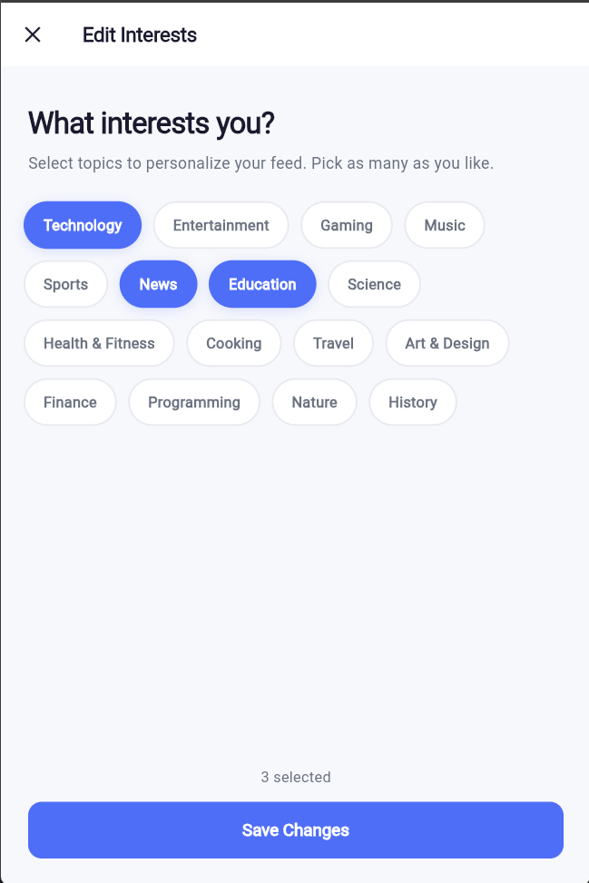

# 📱 Vibee — Centralized Social Media Aggregator

A cross-platform Flutter app that unifies **YouTube**, **Reddit**, and **News** into a single interest-based feed. Users set their interests once, and Vibee curates personalised content from all three platforms — with a built-in **timed session** feature to help manage screen time.

---

## 📸 Screenshots

### Sign In


### Sign Up


### Interests / Preferences


### Home Feed


### Timed Session


### Account Settings


---

## 🛠 Tech Stack

| Component        | Technology                                        |
|------------------|---------------------------------------------------|
| Framework        | Flutter (Dart) — multi-platform (Web, Windows, Mobile) |
| Auth             | Firebase Authentication                           |
| Database         | Cloud Firestore                                   |
| YouTube Content  | YouTube Data API v3                               |
| Reddit Content   | Reddit Public JSON API (no auth needed)           |
| News Content     | NewsAPI (`/everything`, `/top-headlines`)         |
| HTTP             | `http` Dart package                               |
| Image Caching    | `cached_network_image`                            |
| Local Storage    | `shared_preferences`                             |
| Link Handling    | `url_launcher`                                    |

---

## 🧠 Core Concepts

### Centralised Feed
Vibee fetches content from three sources simultaneously based on user-selected interests and merges them into a single scrollable feed. Each card is typed (`video`, `short`, `post`, `article`) and rendered by the unified `MediaCard` widget.

### Interest → Content Mapping
On first login, users pick from 16 interest categories. These map automatically to:
- **YouTube** — keyword search queries (top 3 interests)
- **Reddit** — specific subreddits (e.g. `Technology → r/technology, r/gadgets, r/programming`)
- **News** — keyword OR queries via NewsAPI

```dart
// Example mapping
'Gaming': ['gaming', 'pcgaming', 'ps5'],
'Finance': ['personalfinance', 'investing', 'financialindependence'],
```

### Timed Screen Session
Every session starts with a time picker (default 30 min). A countdown timer runs in the background — when time is up, the session ends and the user is shown a summary. Users can opt to skip the picker in settings (`skipSessionSelection` flag saved to Firestore).

### Auth Gate (Smart Routing)
`AuthGate` uses a `StreamBuilder` + `FutureBuilder` pattern to decide which screen to show on startup:
- Not logged in → `LoginScreen`
- Logged in, no interests set → `InterestsScreen`
- Logged in, skip session picker → `HomeScreen`
- Logged in, show picker → `HomeScreen(showTimePicker: true)`

### Skeleton Loading
A custom `SkeletonLoader` widget shows animated placeholder cards while content is fetching — no blank screens or spinners.

### Firestore Data Model
```
users/{uid}
  ├── email, displayName
  ├── totalContentViewed (incremented per card tap)
  ├── totalMinutesWatched (incremented per session)
  ├── skipSessionSelection (bool)
  └── saved/{itemId}        ← bookmarked items subcollection

user_preferences/{uid}
  ├── interests: [...]
  ├── linkedAccounts: { youtube, reddit, google }
  └── favoriteSubreddits: [...]
```

---

## 📁 File Hierarchy

```
vibee-centralized-social-media/
│
├── lib/
│   ├── main.dart                    # App entry point, Firebase init, AuthGate
│   ├── firebase_options.dart        # Auto-generated Firebase config
│   │
│   ├── core/config/
│   │   ├── api_keys.dart            # YouTube, NewsAPI keys + base URLs
│   │   └── app_theme.dart           # Global ThemeData, colours, text styles
│   │
│   ├── models/
│   │   ├── media_item.dart          # Unified content model (video/post/article)
│   │   └── user_preferences.dart    # Interests, subreddit maps, linked accounts
│   │
│   ├── services/
│   │   ├── auth_service.dart        # Firebase Auth — sign in, sign up, sign out
│   │   ├── firestore_service.dart   # Firestore — profile, preferences, bookmarks
│   │   ├── youtube_service.dart     # YouTube Data API v3 — videos + shorts
│   │   ├── reddit_service.dart      # Reddit public JSON API — subreddit hot posts
│   │   └── news_service.dart        # NewsAPI — interest search + top headlines
│   │
│   ├── screens/
│   │   ├── login_screen.dart        # Sign in + sign up UI
│   │   ├── interests_screen.dart    # Interest picker (first-time setup)
│   │   ├── home_screen.dart         # Main feed — tabbed YouTube/Reddit/News
│   │   ├── timed_session_screen.dart# Session time picker UI
│   │   ├── library_screen.dart      # Saved/bookmarked items
│   │   ├── settings_screen.dart     # App settings, linked accounts, session prefs
│   │   └── account_screen.dart      # User profile, stats, sign out
│   │
│   └── widgets/
│       ├── media_card.dart          # Unified card for all content types
│       └── skeleton_loader.dart     # Animated placeholder loading cards
│
├── web/                             # Flutter Web build target
│   ├── index.html
│   └── manifest.json
│
├── windows/                         # Flutter Windows build target
│
├── test/
│   └── widget_test.dart
│
├── pubspec.yaml                     # Dependencies + project metadata
├── firebase.json                    # Firebase hosting config
└── screenshots/
```

---

## 🔌 External APIs

| API             | Usage                                 | Auth               |
|-----------------|---------------------------------------|--------------------|
| YouTube Data v3 | Search videos + shorts by interest    | API Key            |
| Reddit JSON API | Fetch hot posts from subreddits       | No auth (public)   |
| NewsAPI         | Fetch articles by keyword / headlines | API Key            |

---

## ⚙️ Setup & Run

### 1. Prerequisites
- Flutter SDK `>=3.0.0`
- Firebase project with **Authentication** and **Firestore** enabled
- YouTube Data API v3 key
- NewsAPI key

### 2. Configure API Keys
Add your keys to `lib/core/config/api_keys.dart`:
```dart
class ApiKeys {
  static const String youtubeApiKey = 'YOUR_YOUTUBE_KEY';
  static const String newsApiKey    = 'YOUR_NEWS_API_KEY';
  static const String youtubeBaseUrl = 'https://www.googleapis.com/youtube/v3';
  static const String newsBaseUrl    = 'https://newsapi.org/v2';
  static const String redditBaseUrl  = 'https://www.reddit.com';
}
```

### 3. Firebase Setup
```bash
flutterfire configure
```
This regenerates `firebase_options.dart` for your project.

### 4. Run
```bash
flutter pub get
flutter run                  # mobile/desktop
flutter run -d chrome        # web
```

---

## 📦 Key Dependencies

```yaml
firebase_core: ^3.0.0
firebase_auth: ^5.0.0
cloud_firestore: ^5.0.0
http: ^1.2.0
cached_network_image: ^3.3.0
shared_preferences: ^2.2.0
url_launcher: ^6.2.0
intl: ^0.19.0
```

---

## 🎨 Theme

The app uses a custom `AppTheme` defined in `lib/core/config/app_theme.dart` — a clean light theme with a blue accent palette applied globally via `MaterialApp.theme`.
